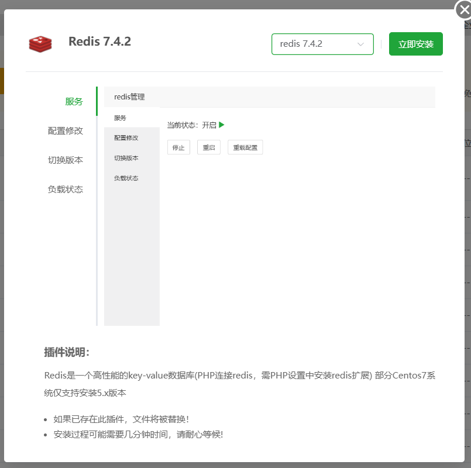
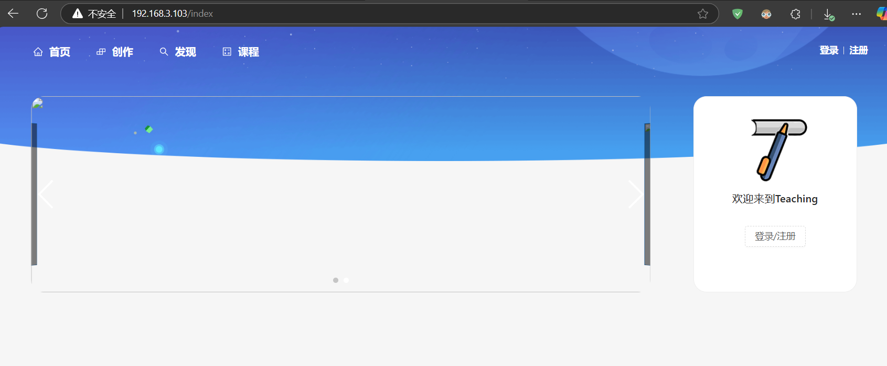

宝塔官网下载页面
`https://www.bt.cn/new/download.html`

liunx 宝塔安装包 编写文档时宝塔版本为9.4.0。

通用安装脚本

`if [ -f /usr/bin/curl ];then curl -sSO https://download.bt.cn/install/install_panel.sh;else wget -O install_panel.sh https://download.bt.cn/install/install_panel.sh;fi;bash install_panel.sh ed8484bec`

Centos/OpenCloud/Alibaba

`url=https://download.bt.cn/install/install_panel.sh;if [ -f /usr/bin/curl ];then curl -sSO $url;else wget -O install_panel.sh $url;fi;bash install_panel.sh ed8484bec`

Debian

`wget -O install_panel.sh https://download.bt.cn/install/install_panel.sh && bash install_panel.sh ed8484bec`

Ubuntu/Deepin

`wget -O install_panel.sh https://download.bt.cn/install/install_panel.sh && sudo bash install_panel.sh ed8484bec`


输入安装命令回车后会有一小段时间的卡顿，主要是安装脚本在进行环境检查，之后静静等待安装完成即可。
安装时间长短主要取决于下载宝塔资源时间及机器CPU配置。


出现下述图示，说明安装完成。


【云服务器】请在安全组放行 21465 端口
外网面板地址: http://[2408:8215:46c:1f74:bc1a:e440:3b0d:a]:21465/91eed7d0
内网面板地址: http://192.168.3.103:21465/91eed7d0
username: sx3saqvw
password: 4058844f


当前版本安装好宝塔后强制绑定宝塔官网账号，记得提前注册

选择jdk，数据库，nginx 进行安装，生产环境更倾向使用编译安装（时间比较长）。

此时推荐安装中没有redis 还需要我们安装redis





teachingopen


此时访问
http://ip:8081/api


```nginx

server
{
    listen 80 default_server;
    server_name demo.teaching.com; # 改为你网站的域名
    location / {
      index index.html index.htm;
      root /www/wwwroot/teachingopen/web; # 改为你网站目录的路径
      if (!-e $request_filename) {
          rewrite ^(.*)$ /index.html?s=$1 last;
          break;
      }
      gzip on;
      gzip_min_length 1k;
      gzip_comp_level 9;
      gzip_types text/plain application/javascript application/x-javascript text/css application/xml text/javascript application/x-httpd-php image/jpeg image/gif image/png;
      gzip_vary on;
      gzip_disable "MSIE [1-6]\.";
    }
    
    location ^~ /api
    {
        expires 0;
        proxy_pass              http://127.0.0.1:8081/api/;
        proxy_set_header        Host 127.0.0.1;
        proxy_set_header        X-Real-IP $remote_addr;
        proxy_set_header        X-Forwarded-For $proxy_add_x_forwarded_for;
        add_header X-Cache $upstream_cache_status;
        add_header Cache-Control no-cache;
    }
}

```


